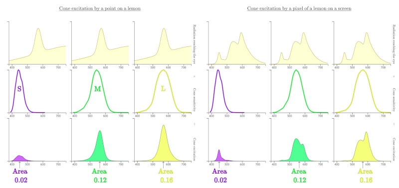

<!-- README.md is generated from README.Rmd. Please edit that file -->

# metamer

[](https://travis-ci.org/eliocamp/metamer)

Implements the algorithm proposed by [Matejka & Fitzmaurice
(2017)](https://www.autodeskresearch.com/publications/samestats) to
create metamers (datasets with identical statistical properties but very
different graphs).

In colour theory,
[metamers](https://en.wikipedia.org/wiki/Metamerism_\(color\)) are
colours that have very different wavelength distribution but are
perceived as equal by out visual system. This happens because out eyes
essentially summarise a continuous distribution of wavelength by just 3
numbers: the amount that each type of cone cell is exited. Colour
metamerism is how artists can reproduce so many colours with a few
pigments, or how PC monitors use only 3 lights to show colourful
pictures.



(from the excellent [Color: From Hexcodes to
Eyeballs](http://jamie-wong.com/post/color/) by [Jamie
Wong](https://github.com/jlfwong))

Statistical transformations such as mean, standard deviation and
correlation behave very similarly in that they summarise data with just
a few numbers for the benefit of our limited cognitive capacity. Thus,
statistical metamers are sets of data that share some statistical
properties.

## Installation

You can install metamer with:

``` r
install.packages("metamer")
```

or install the development version with:

``` r
# install.packages("devtools")
devtools::install_github("eliocamp/metamer")
```

## Example

You can construct metamers from a starting dataset and a vector of
statistical properties to remain constant (by default, up to 2
significant figures).

``` r
library(metamer)
# Start with the datasaurus
# install.packages("datasauRus")
start <- subset(datasauRus::datasaurus_dozen, dataset == "dino")
start$dataset <- NULL

# And we want to preserve means and correlation
mean_cor <- delayed_with(mean(x), mean(y), cor(x, y)) 
N <- 20000
set.seed(42) # To make results reproducible
metamers <- metamerize(start, preserve = mean_cor, N = N)
print(metamers)
#> List of 12782 metamers
```

We found 12782 metamers. Let’s see the final one, with the starting
dataset as background.

``` r
library(ggplot2)

ggplot(metamers[[length(metamers)]], aes(x, y)) +
  geom_point(data = start, color = "red", alpha = 0.5, size = 0.4) +
  geom_point()
```


We can check that the statistical properties have been preserved up to 2
significant figures:

``` r
cbind(dino = signif(mean_cor(start), 2),
      last = signif(mean_cor(metamers[[length(metamers)]]), 2))
#>        dino   last
#> [1,] 54.000 54.000
#> [2,] 48.000 48.000
#> [3,] -0.064 -0.064
```

However, a semi random cloud of points is not that interesting, so we
can specify a minimizing function so that the result is similar to
another dataset. `metamerize` will start from the last metamer of the
previous run if the `data` argument is a list of metamers and append the
result.

``` r
target1 <- subset(datasauRus::datasaurus_dozen, dataset == "x_shape")
target1$dataset <- NULL
```

``` r
metamers <- metamerize(metamers, 
                       minimize = mean_dist_to(target1), 
                       N = N)
```

Now the result is a bit more impressive.

``` r
ggplot(metamers[[length(metamers)]], aes(x, y)) +
  geom_point(data = start, color = "red", alpha = 0.5, size = 0.4) +
  geom_point()
```


We can animate the whole thing. Since 19048 metamers is overkill, first
we keep only 200 of them.

``` r
library(gganimate)
metamers_anim <- trim(metamers, 30*2)

ggplot(as.data.frame(metamers_anim), aes(x, y)) +
  geom_point() +
  transition_manual(.metamer)
#> nframes and fps adjusted to match transition
```


You can freehand your own starting or target data with the `draw_data()`
utility, that will open a shiny interface. You might need to install
`shiny` and `miniUI` with `install.packages(c("shiny", "miniUI"))`.

Metamerizing operations can be chained while changing the minimizing
function.

``` r
library(magrittr)
target2 <- subset(datasauRus::datasaurus_dozen, dataset == "star")
target2$dataset <- NULL

metamers <- metamerize(start,
                       preserve = mean_cor, 
                       minimize = mean_dist_to(target1),
                       N = N) %>% 
  set_minimize(mean_dist_to(target2)) %>% 
  metamerize(N = N) %>% 
  set_minimize(mean_dist_to(start)) %>% 
  metamerize(N = N)
```

And the full sequence

``` r
trim(metamers, 30*3) %>% 
  as.data.frame() %>% 
  ggplot(aes(x, y)) +
  geom_point() +
  transition_manual(.metamer)
```


